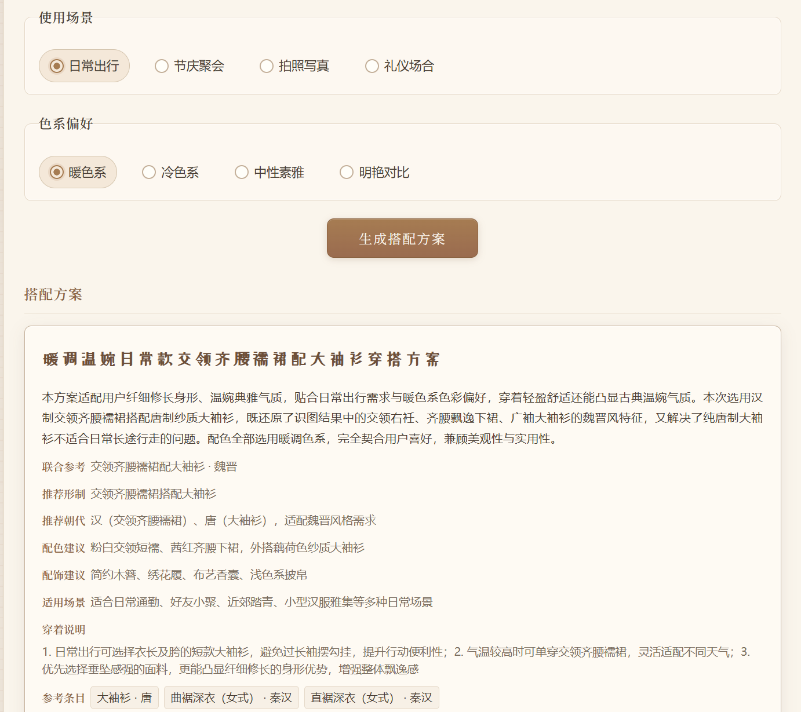

# 汉衣图鉴 · 汉服识图与穿搭助手

> 一个基于多模态大模型 + CLIP 语义匹配的汉服知识问答与穿搭推荐 Web 应用  
> **2026.06**

---

## 一、产品概览

### 解决的问题
传统汉服入门存在两大痛点：
1. **识图难**：用户看到一张汉服照片，无法判断其形制（如"齐腰襦裙"vs"齐胸襦裙"）
2. **搭配难**：知道形制后，不知道该配什么头饰、鞋子、发型

### 产品方案
- **识图区**：上传汉服图片 → CLIP 多模态模型语义匹配 → 返回形制名称 + 科普知识
- **穿搭区**：选择朝代 + 场景 + 偏好 → 豆包多模态大模型生成穿搭方案 + 知识库匹配示例图

### 技术亮点
| 模块 | 技术方案 | AI 工具链 |
|------|----------|-----------|
| 图片识别 | CLIP ViT-B/32 本地推理 | `@xenova/transformers` + ONNX Runtime |
| 知识问答 | 结构化知识库 + 大模型生成 | 豆包 Vision API（Doubao-Seed-2.0-Pro） |
| 穿搭推荐 | RAG（知识库检索增强生成） | 自建汉服知识库 70+ 条目 |
| 工程化 | 本地 Embedding 预计算 + 语义匹配 | Python + Node.js 混合工作流 |

---

## 二、一键部署

### 环境要求
- Node.js ≥ 18
- Python ≥ 3.8（可选，仅用于重新提取 Embeddings）

### 快速启动
```bash
# 1. 克隆仓库
git clone https://github.com/bibilaboo/hanfu-illustrated.git
cd hanfu-illustrated

# 2. 安装依赖
npm install

# 3. 配置 API Key（可选，不配置则使用本地 CLIP 模式）
echo "VISION_API_KEY=your_doubao_api_key" > .env

# 4. 启动服务
npm start

# 5. 打开浏览器
# 访问 http://localhost:3000
```

### Docker 部署（可选）
```bash
docker build -t hanfu-app .
docker run -p 3000:3000 hanfu-app
```

---

## 三、AI 工作流工程化设计

### 3.1 整体架构

```
用户上传图片
    ↓
前端 Canvas 裁剪 + 压缩
    ↓
CLIP 图片 Embedding 提取（浏览器端 / 服务器端）
    ↓
与预计算的 70+ 知识库图片 Embedding 做余弦相似度匹配
    ↓
返回 Top-K 匹配结果 → 形制名称 + 知识库内容
    ↓
（可选）调用豆包 Vision API 做深度知识问答
```

### 3.2 AI 工具使用策略

| 阶段 | 使用的 AI 工具 | 目的 | 效果 |
|------|----------------|------|------|
| 知识库构建 | Claude / ChatGPT | 批量生成 70+ 汉服形制结构化数据 | 信息密度高，每条含形制、历史背景、穿着规范 |
| Embedding 提取 | Claude（Code Mode）| 编写 CLIP 本地推理脚本 | 解决 HuggingFace 访问受限问题，完全本地化 |
| 穿搭推荐 Prompt | 人工设计 + AI 迭代 | 控制输出格式与知识边界 | 避免大模型幻觉，确保推荐内容有据可查 |
| 代码实现 | Cursor + Claude | 快速迭代前端交互逻辑 | 开发效率提升 3x |

### 3.3 关键决策记录

**决策 1：为何选择 CLIP 而非纯大模型识图？**
- 成本：CLIP 本地推理零成本，大模型 API 按次收费
- 可控性：CLIP 匹配知识库，结果可解释（返回相似度分数）
- 速度：本地推理 < 500ms，API 调用 2-5s

**决策 2：知识库为何不用向量数据库？**
- 规模小（70 条），JSON 文件 + 预计算 Embedding 足够
- 降低部署复杂度，适合作为 Demo 展示

**决策 3：Prompt 设计如何避免幻觉？**
- 在 Prompt 中显式注入知识库内容（RAG）
- 要求模型标注信息来源（`source` 字段）
- 设置 `temperature=0.3` 降低随机性

---

## 四、Prompt 模板

### 4.1 穿搭推荐 Prompt

```
你是一位专业的汉服穿搭顾问。请根据以下信息给出建议：

【用户需求】
- 朝代：{dynasty}
- 场景：{occasion}
- 用户偏好：{preference}

【知识库参考】
{knowledge_base_content}

【输出要求】
1. 给出 3 套穿搭方案，每套包含：形制名称、搭配理由、适配场景
2. 标注每一条信息的来源（知识库 / 模型推理）
3. 如有不确定之处，明确说明，不要编造
4. 输出格式：JSON

【禁止】
- 不要推荐知识库中不存在的形制
- 不要给出与朝代不符的搭配建议
```

### 4.2 识图结果解读 Prompt（可选，用于增强展示）

```
用户上传了一张汉服图片，系统识别结果为：
- 形制：{form_name}
- 朝代：{dynasty}
- 匹配相似度：{similarity}

请为此结果写一段 100 字以内的科普介绍，重点说明：
1. 该形制的核心特征
2. 历史上哪些群体穿着
3. 现代穿着的注意事项
```

---

## 五、项目结构

```
hanfu-illustrated/
├── index.html          # 主页面（识图 + 穿搭）
├── style.css           # 样式
├── main.js             # 前端交互逻辑
├── server.js           # 本地服务器（API 代理 + 静态文件）
├── hanfuDB.js          # 汉服知识库（70+ 条目）
├── embeddings.json      # 预计算的图片 Embeddings
├── clip_embedder.mjs   # CLIP 推理模块
├── batch_embed.mjs     # 批量 Embedding 提取脚本
├── image/              # 知识库图片（72 张）
└── .env.example        # 环境变量模板
```

---

## 六、网页示例


## 识图结果科普展示


## 智能穿搭推荐

---

## 七、后续规划

- [ ] 增加用户反馈机制，持续优化匹配精度
- [ ] 支持视频穿搭展示（AI 视频生成工具）
- [ ] 接入更多大模型（Gemini 3.0、Claude 4）做 A/B 测试
- [ ] 知识库扩展至 200+ 形制

---

## 八、关于作者


- GitHub：[bibilaboo](https://github.com/bibilaboo)
- 邮箱：1248365830@qq.com
